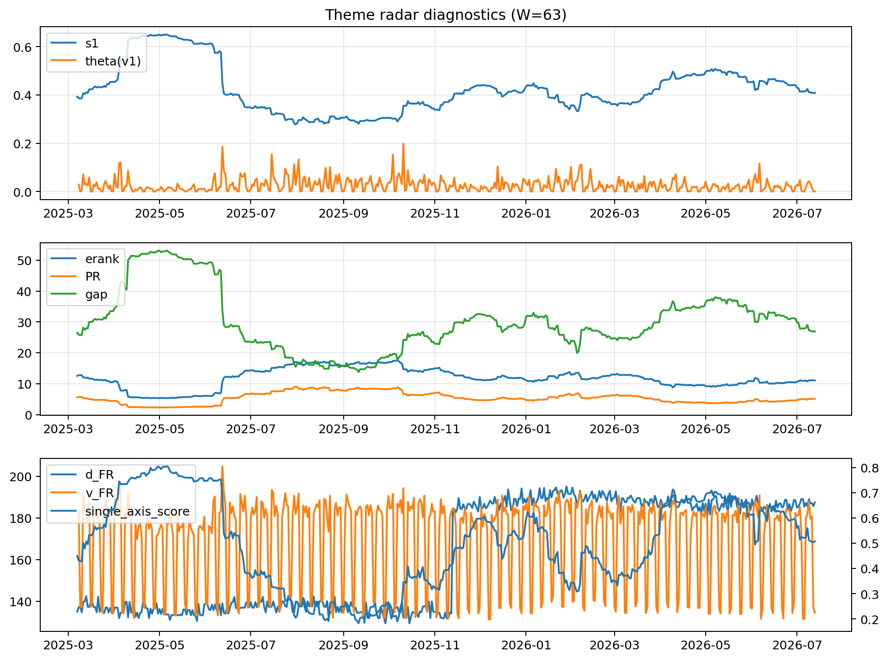

# Theme Radar Daily Brief — 2026-07-13

## Leaders (v1) — W=63
- **Nuclear_Uranium** (0.0845565629436176)
- Semis (0.0647497116973901)
- Grid_Power (0.0538766380829834)

## Challengers — W=63
**v2:** Semis (0.092213647689787), MegaCap_AI (0.069673771834955), Rates (0.0618471740434553)
**v3:** Software_Cloud (0.1177433277566961), MegaCap_AI (0.0760266306127995), Cyber (0.0696193895825289)

## Migration (20D slope) — W=63
**Top risers:**
- axis_Cyber: 0.0004104860404945
- axis_Software_Cloud: 0.000341639789281
- axis_Sector_ConsStap: 0.0002588535547051
- axis_Clean_Broad: 0.0001876562363119
- axis_Semis: 0.0001817324657555
- axis_Nuclear_Uranium: 0.0001482028425622
- axis_Critical_Minerals: 0.0001340720460062
- axis_Equity_US: 0.0001287280481599
- axis_Sector_Health: 0.0001052120007423
- axis_Grid_Power: 0.0001040059678673

**Top fallers:**
- axis_Sector_Materials: -0.0001220614737293
- axis_Crypto: -0.0001411438232304
- axis_Rates: -0.0001465208372962
- axis_Sector_Utilities: -0.0001499225296326
- axis_Sector_Comm: -0.0001631698963007
- axis_Drones_Autonomy: -0.000197170161079
- axis_Commodities: -0.0002839085061472
- axis_Genomics_Bio: -0.0002874892090136
- axis_Metals: -0.000291514408732
- axis_DataCenter_Infra: -0.0005614659772961

## Risk line (W=63)
- s1: 0.4083871671072825
- theta_v1: 0.000494640362939
- v_FR: 134.55740194730515
- single_axis_score: 0.5072874493927125

## Interpretation
**Regime:** `theme_migration`

- Action: Tomorrow watchlist: Cyber, Software_Cloud, Sector_ConsStap, Clean_Broad, Semis + v2_top1=Semis
- Action: Hedge note: normal correlation stability.

- Percentiles (W=63 history): vfr_pct=0.11, theta_pct=0.17, s1_pct=0.50, score_pct=0.49.

---
**BUNDLE_ROOT_SHA256:** `dce30259bbb0cd5afed98b7f5e76eede43617545449404b8d397079e1fd6f9e0`
