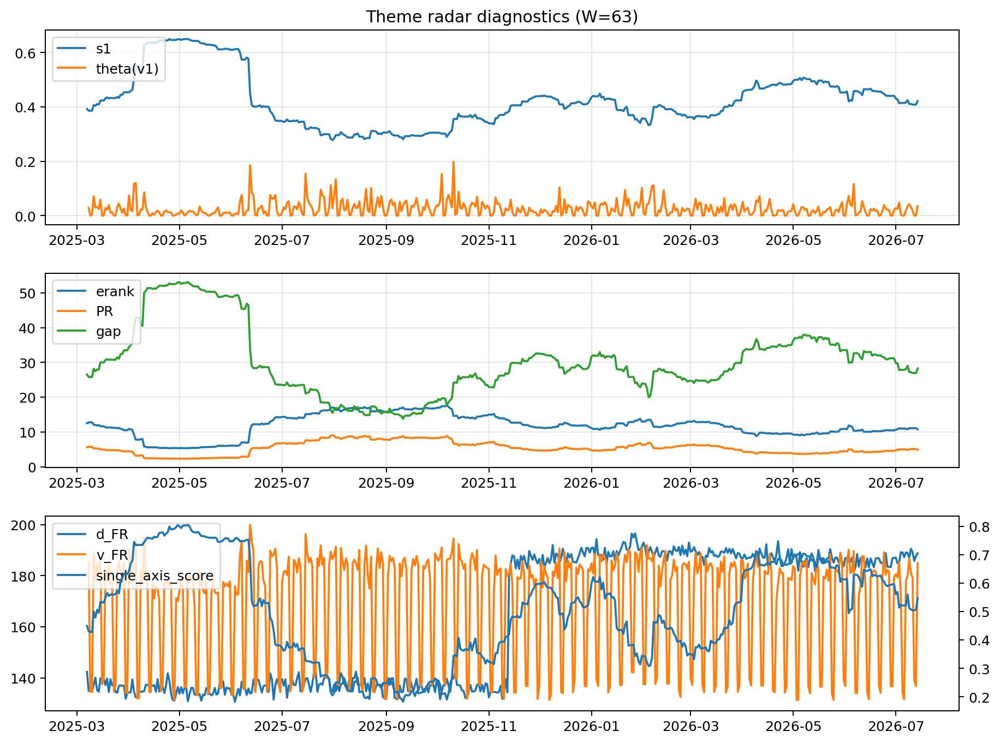

# Theme Radar Daily Brief — 2026-07-14

## Leaders (v1) — W=63
- **Nuclear_Uranium** (0.0841233473521173)
- Semis (0.0646736332880364)
- Grid_Power (0.0525807745816991)

## Challengers — W=63
**v2:** Semis (0.0968160092456711), MegaCap_AI (0.0683323274283291), Grid_Power (0.0613081720328323)
**v3:** Software_Cloud (0.1175823197813017), MegaCap_AI (0.0744050476297862), Cyber (0.0696599862167164)

## Migration (20D slope) — W=63
**Top risers:**
- axis_Cyber: 0.0004375725977542
- axis_Software_Cloud: 0.0003934273259207
- axis_Sector_ConsStap: 0.0002594251185823
- axis_Clean_Broad: 0.0001815611092262
- axis_Semis: 0.0001617503641821
- axis_Nuclear_Uranium: 0.000128193891587
- axis_Critical_Minerals: 0.0001130554358951
- axis_Sector_Health: 0.000112167463006
- axis_Equity_US: 0.0001110264073715
- axis_Clean_Solar: 9.2567356208069e-05

**Top fallers:**
- axis_Crypto: -0.0001098761731358
- axis_USD: -0.0001112189070246
- axis_Sector_Materials: -0.0001278701582467
- axis_Sector_Utilities: -0.0001474534401565
- axis_Sector_Comm: -0.0001602717047655
- axis_Drones_Autonomy: -0.0001994525216509
- axis_Commodities: -0.0002282140213496
- axis_Metals: -0.0002761237503109
- axis_Genomics_Bio: -0.0003254906327826
- axis_DataCenter_Infra: -0.0005922813183038

## Risk line (W=63)
- s1: 0.4208167123462507
- theta_v1: 0.0352584661888467
- v_FR: 184.88912629751795
- single_axis_score: 0.5470707070707072

## Interpretation
**Regime:** `theme_migration`

- Action: Tomorrow watchlist: Cyber, Software_Cloud, Sector_ConsStap, Clean_Broad, Semis + v2_top1=Semis
- Action: Hedge note: normal correlation stability.

- Percentiles (W=63 history): vfr_pct=0.73, theta_pct=0.74, s1_pct=0.55, score_pct=0.57.

---
**BUNDLE_ROOT_SHA256:** `6eed69c34292a55224f91199346ff1d37ca375520253476b1c7276f35894676a`
