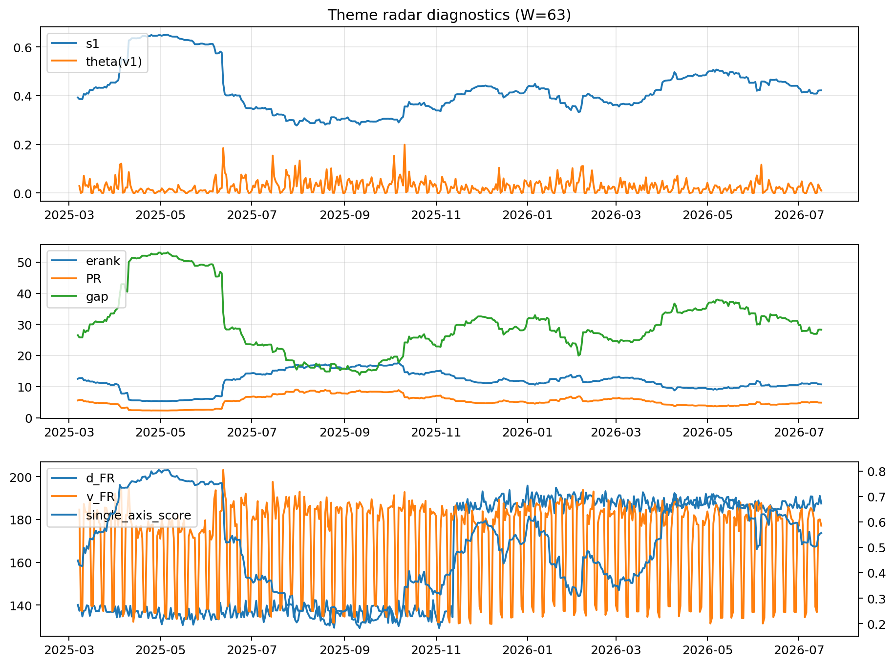

# Theme Radar Daily Brief — 2026-07-16

## Leaders (v1) — W=63
- **Nuclear_Uranium** (0.0847553044363633)
- Semis (0.0645248809514344)
- Grid_Power (0.0526950417293534)

## Challengers — W=63
**v2:** Semis (0.0950963290898905), MegaCap_AI (0.0726262648476883), Grid_Power (0.0598094010184272)
**v3:** Software_Cloud (0.1166325819228928), MegaCap_AI (0.0741481384409771), Crypto (0.0708314793100273)

## Migration (20D slope) — W=63
**Top risers:**
- axis_Cyber: 0.0004601545445682
- axis_Software_Cloud: 0.0004246900793271
- axis_Sector_ConsStap: 0.000255312647364
- axis_Clean_Broad: 0.0001793662312811
- axis_Nuclear_Uranium: 0.000137726200908
- axis_Semis: 0.000121565635137
- axis_Sector_Health: 0.0001204342540309
- axis_Vol: 0.0001100346871839
- axis_Sector_Energy: 0.000105767864637
- axis_Critical_Minerals: 9.1946013827986e-05

**Top fallers:**
- axis_Defense: -6.518805319638682e-05
- axis_USD: -0.0001142310030715
- axis_Sector_Utilities: -0.0001259807728498
- axis_Sector_Materials: -0.0001280594748231
- axis_Sector_Comm: -0.0001526191834405
- axis_Drones_Autonomy: -0.000156369456123
- axis_Commodities: -0.0001746359779898
- axis_Metals: -0.0002279642935809
- axis_Genomics_Bio: -0.0004507350015932
- axis_DataCenter_Infra: -0.0006204222805594

## Risk line (W=63)
- s1: 0.421691793591353
- theta_v1: 0.0096376693047711
- v_FR: 177.080041544094
- single_axis_score: 0.5565392354124747

## Interpretation
**Regime:** `theme_migration`

- Action: Tomorrow watchlist: Cyber, Software_Cloud, Sector_ConsStap, Clean_Broad, Nuclear_Uranium + v2_top1=Semis
- Action: Hedge note: normal correlation stability.

- Percentiles (W=63 history): vfr_pct=0.38, theta_pct=0.33, s1_pct=0.56, score_pct=0.59.

---
**BUNDLE_ROOT_SHA256:** `40e34845277cfec8393cb0188db940d6882a3a1a023d16c96de81ab66ebd21a6`
