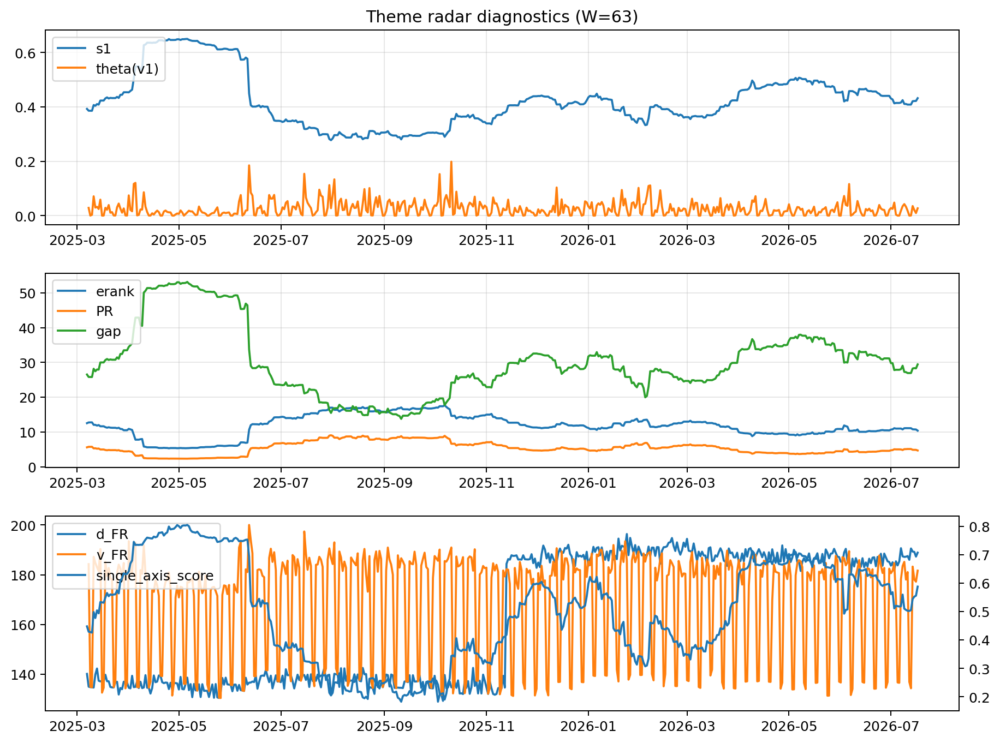

# Theme Radar Daily Brief — 2026-07-17

## Leaders (v1) — W=63
- **Nuclear_Uranium** (0.0845606844383758)
- Semis (0.0647325576508287)
- Grid_Power (0.0520509323950288)

## Challengers — W=63
**v2:** Semis (0.0945067989055317), MegaCap_AI (0.0729912104277754), Grid_Power (0.0611953594565236)
**v3:** Software_Cloud (0.1147231322008842), MegaCap_AI (0.069245684357618), Cyber (0.067180172179647)

## Migration (20D slope) — W=63
**Top risers:**
- axis_Cyber: 0.0004482734986898
- axis_Software_Cloud: 0.0004152482370352
- axis_Sector_ConsStap: 0.0002490911530655
- axis_Clean_Broad: 0.0001645790168636
- axis_Nuclear_Uranium: 0.0001540171800078
- axis_Sector_Health: 0.0001295737050371
- axis_Vol: 0.000113778603358
- axis_Sector_Energy: 0.0001136538529326
- axis_Semis: 0.0001012508484156
- axis_Clean_Solar: 8.868234355699758e-05

**Top fallers:**
- axis_MegaCap_AI: -8.148064545040498e-05
- axis_Sector_Utilities: -0.0001032046254192
- axis_USD: -0.0001109450268465
- axis_Drones_Autonomy: -0.0001296231266435
- axis_Sector_Materials: -0.0001336851914647
- axis_Sector_Comm: -0.0001411092469825
- axis_Commodities: -0.0001665969398869
- axis_Metals: -0.0001907277517893
- axis_Genomics_Bio: -0.00043465792506
- axis_DataCenter_Infra: -0.0005968302397969

## Risk line (W=63)
- s1: 0.4319750119588113
- theta_v1: 0.0270108348361069
- v_FR: 181.67260217035167
- single_axis_score: 0.5875502008032129

## Interpretation
**Regime:** `theme_migration`

- Action: Tomorrow watchlist: Cyber, Software_Cloud, Sector_ConsStap, Clean_Broad, Nuclear_Uranium + v2_top1=Semis
- Action: Hedge note: normal correlation stability.

- Percentiles (W=63 history): vfr_pct=0.56, theta_pct=0.62, s1_pct=0.61, score_pct=0.64.

---
**BUNDLE_ROOT_SHA256:** `1337b01222e12f8df30b2cfd0028208329ddb61dc62fb9b18d072a65393f88b1`
