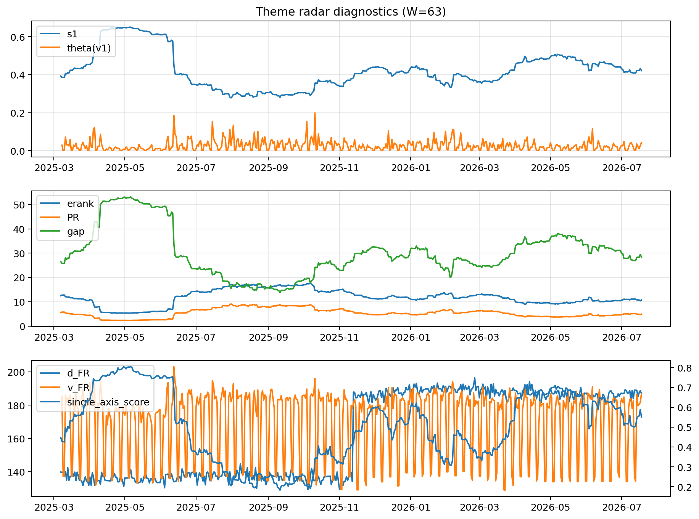

# Theme Radar Daily Brief — 2026-07-18

## Leaders (v1) — W=63
- **Nuclear_Uranium** (0.0845107578606115)
- Semis (0.0649854287781435)
- Grid_Power (0.0520740958895985)

## Challengers — W=63
**v2:** Semis (0.0935173291036851), MegaCap_AI (0.0799017933979241), Grid_Power (0.0651828342827173)
**v3:** Software_Cloud (0.1068612009834297), Crypto (0.0646559685446022), DataCenter_Infra (0.0630705630513953)

## Migration (20D slope) — W=63
**Top risers:**
- axis_Cyber: 0.0004469311045068
- axis_Software_Cloud: 0.0004293708087794
- axis_Sector_ConsStap: 0.0002461583562564
- axis_Nuclear_Uranium: 0.0001666369724608
- axis_Clean_Broad: 0.0001542847064483
- axis_Sector_Health: 0.0001488212815957
- axis_Vol: 0.0001153464541198
- axis_Sector_Energy: 0.0001113711906909
- axis_Sector_RealEstate: 0.0001021027438948
- axis_Clean_Solar: 9.588207858061883e-05

**Top fallers:**
- axis_Defense: -7.86336598553928e-05
- axis_MegaCap_AI: -9.967152419504916e-05
- axis_Drones_Autonomy: -0.000103045906354
- axis_USD: -0.0001128053930862
- axis_Sector_Comm: -0.000129949346148
- axis_Sector_Materials: -0.000143157602668
- axis_Metals: -0.0001598247566886
- axis_Commodities: -0.0001615073084449
- axis_Genomics_Bio: -0.0004216233876456
- axis_DataCenter_Infra: -0.0005838427366797

## Risk line (W=63)
- s1: 0.421109090067785
- theta_v1: 0.0422659549606987
- v_FR: 186.7993673703726
- single_axis_score: 0.5511022044088176

## Interpretation
**Regime:** `theme_migration`

- Action: Tomorrow watchlist: Cyber, Software_Cloud, Sector_ConsStap, Nuclear_Uranium, Clean_Broad + v2_top1=Semis
- Action: Hedge note: normal correlation stability.

- Percentiles (W=63 history): vfr_pct=0.87, theta_pct=0.80, s1_pct=0.55, score_pct=0.58.

---
**BUNDLE_ROOT_SHA256:** `cec2aed2ce751366302e2e920735b33ea2f1bda8033cf36997e98097df4d3513`
