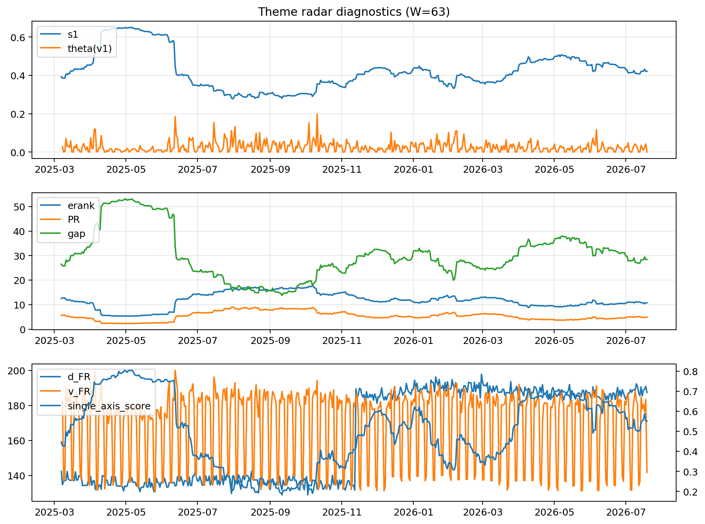

# Theme Radar Daily Brief — 2026-07-19

## Leaders (v1) — W=63
- **Nuclear_Uranium** (0.0845134775080981)
- Semis (0.0649827341150412)
- Grid_Power (0.0520731456211014)

## Challengers — W=63
**v2:** Semis (0.0935474898935875), MegaCap_AI (0.0799275089985658), Grid_Power (0.0651901735485742)
**v3:** Software_Cloud (0.1067838278327398), Crypto (0.0647814146894065), DataCenter_Infra (0.0630123509585706)

## Migration (20D slope) — W=63
**Top risers:**
- axis_Cyber: 0.0004327297286907
- axis_Software_Cloud: 0.0004316203383534
- axis_Sector_ConsStap: 0.0002358640031393
- axis_Nuclear_Uranium: 0.0001761794494134
- axis_Sector_Health: 0.0001629604657012
- axis_Sector_RealEstate: 0.0001544935159417
- axis_Clean_Broad: 0.0001391115452364
- axis_Vol: 0.0001139999217818
- axis_Sector_Energy: 0.0001067978403549
- axis_Clean_Solar: 0.000100061719874

**Top fallers:**
- axis_Defense: -8.772988168476662e-05
- axis_Quantum: -8.988316834360916e-05
- axis_USD: -0.0001115744886908
- axis_Sector_Comm: -0.0001151671770788
- axis_MegaCap_AI: -0.0001198255514369
- axis_Metals: -0.0001243191318977
- axis_Sector_Materials: -0.0001471255373259
- axis_Commodities: -0.0001503680564195
- axis_Genomics_Bio: -0.0004023193800294
- axis_DataCenter_Infra: -0.0005525326863009

## Risk line (W=63)
- s1: 0.4211235111722345
- theta_v1: 0.0002739995941973
- v_FR: 141.7732569703129
- single_axis_score: 0.5516000000000001

## Interpretation
**Regime:** `theme_migration`

- Action: Tomorrow watchlist: Cyber, Software_Cloud, Sector_ConsStap, Nuclear_Uranium, Sector_Health + v2_top1=Semis
- Action: Hedge note: normal correlation stability.

- Percentiles (W=63 history): vfr_pct=0.28, theta_pct=0.12, s1_pct=0.55, score_pct=0.58.

---
**BUNDLE_ROOT_SHA256:** `347a52373fa5cb94d0170602d773449d2f976a4cc5901bb221ab34c51f54c851`
