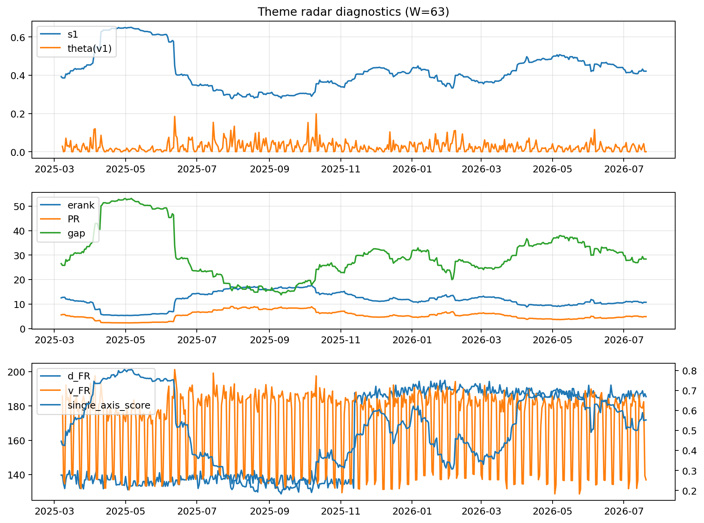

# Theme Radar Daily Brief — 2026-07-20

## Leaders (v1) — W=63
- **Nuclear_Uranium** (0.0845097399570226)
- Semis (0.0649740346925225)
- Grid_Power (0.0520667928834498)

## Challengers — W=63
**v2:** Semis (0.0935706112527664), MegaCap_AI (0.0799381832917964), Grid_Power (0.0652124453245684)
**v3:** Software_Cloud (0.1066933606593154), Crypto (0.0649234304966754), DataCenter_Infra (0.0629621415276057)

## Migration (20D slope) — W=63
**Top risers:**
- axis_Software_Cloud: 0.0004287313666491
- axis_Cyber: 0.0004180863073111
- axis_Sector_ConsStap: 0.0002213105576241
- axis_Sector_RealEstate: 0.0001985942575461
- axis_Sector_Health: 0.0001718470733557
- axis_Nuclear_Uranium: 0.0001700511947496
- axis_Clean_Broad: 0.0001208796943237
- axis_Vol: 0.0001107157857898
- axis_Clean_Solar: 0.0001013070035029
- axis_Sector_Energy: 0.0001004127058639

**Top fallers:**
- axis_Rates: -9.373001996575904e-05
- axis_Defense: -9.50084375899335e-05
- axis_Metals: -0.0001015837872962
- axis_Quantum: -0.0001047675332641
- axis_USD: -0.0001057914702321
- axis_MegaCap_AI: -0.000133589337945
- axis_Commodities: -0.000137685772399
- axis_Sector_Materials: -0.0001594711585166
- axis_Genomics_Bio: -0.0003678635229947
- axis_DataCenter_Infra: -0.0005079169399208

## Risk line (W=63)
- s1: 0.4211616383261668
- theta_v1: 0.0005174480767584
- v_FR: 136.9149375053398
- single_axis_score: 0.5524950099800399

## Interpretation
**Regime:** `theme_migration`

- Action: Tomorrow watchlist: Software_Cloud, Cyber, Sector_ConsStap, Sector_RealEstate, Sector_Health + v2_top1=Semis
- Action: Hedge note: normal correlation stability.

- Percentiles (W=63 history): vfr_pct=0.17, theta_pct=0.17, s1_pct=0.55, score_pct=0.59.

---
**BUNDLE_ROOT_SHA256:** `4b477eef0e05f4f4b00f1760571d00851c7de331f5be208fa52bb74060155938`
