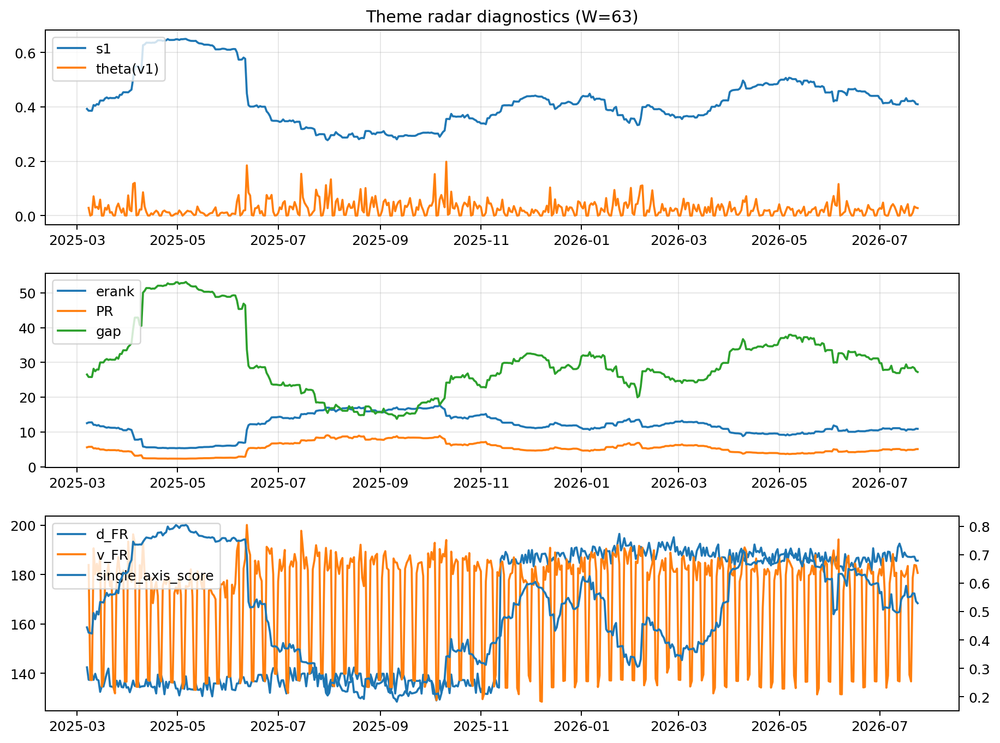

# Theme Radar Daily Brief — 2026-07-24

## Leaders (v1) — W=63
- **Nuclear_Uranium** (0.0863095226901637)
- Semis (0.0676004224821257)
- Quantum (0.053551701225687)

## Challengers — W=63
**v2:** Semis (0.0876938178680098), MegaCap_AI (0.0866760212016556), Grid_Power (0.0673299447771725)
**v3:** Software_Cloud (0.0996328899305217), DataCenter_Infra (0.0639001469542197), Grid_Power (0.0601316990283216)

## Migration (20D slope) — W=63
**Top risers:**
- axis_Sector_RealEstate: 0.000293930686549
- axis_Software_Cloud: 0.0002900330078998
- axis_Cyber: 0.0002894367984767
- axis_Nuclear_Uranium: 0.0001931606261535
- axis_Sector_Utilities: 0.0001620432607945
- axis_Sector_ConsStap: 0.0001608540332566
- axis_Sector_Health: 0.0001441963414419
- axis_Vol: 0.0001202242243553
- axis_Crypto: 0.0001192647186184
- axis_Clean_Broad: 0.0001135142367224

**Top fallers:**
- axis_USD: -9.75643863805182e-05
- axis_Sector_ConsDisc: -0.0001060385374592
- axis_Defense: -0.0001061685393075
- axis_Credit: -0.0001507029836504
- axis_MegaCap_AI: -0.0001604597811946
- axis_Genomics_Bio: -0.0001819481881943
- axis_Sector_Materials: -0.0001931884096999
- axis_Commodities: -0.0002144432082389
- axis_Rates: -0.000390554302132
- axis_DataCenter_Infra: -0.0004284526183388

## Risk line (W=63)
- s1: 0.409540248270929
- theta_v1: 0.027802600951572
- v_FR: 180.6530308979373
- single_axis_score: 0.5291089108910891

## Interpretation
**Regime:** `theme_migration`

- Action: Tomorrow watchlist: Sector_RealEstate, Software_Cloud, Cyber, Nuclear_Uranium, Sector_Utilities + v2_top1=Semis
- Action: Hedge note: normal correlation stability.

- Percentiles (W=63 history): vfr_pct=0.52, theta_pct=0.63, s1_pct=0.50, score_pct=0.53.

---
**BUNDLE_ROOT_SHA256:** `19634ab0e4a7a022beb727412eeb13227de712531909b3c80e0519970bf2d7b9`
