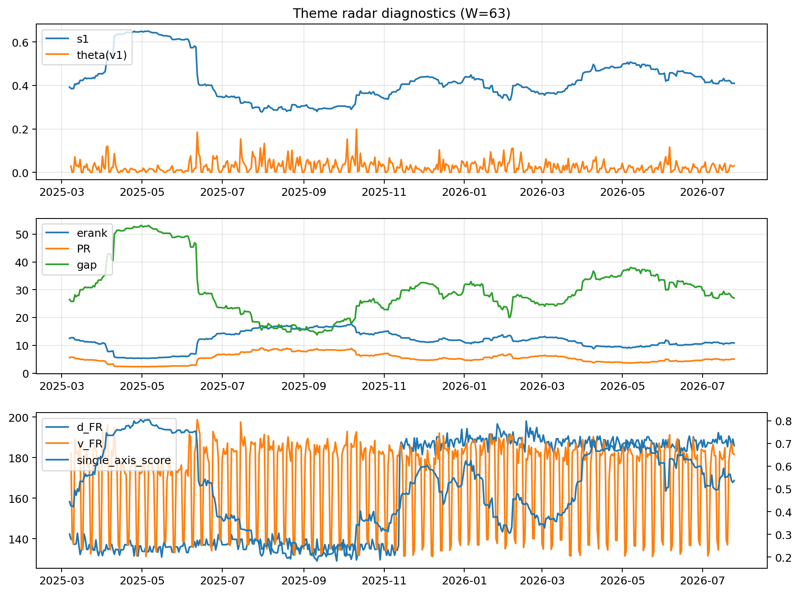

# Theme Radar Daily Brief — 2026-07-25

## Leaders (v1) — W=63
- **Nuclear_Uranium** (0.0865456056229203)
- Semis (0.0681945619994366)
- Quantum (0.0554786565935305)

## Challengers — W=63
**v2:** Semis (0.0863353165112839), MegaCap_AI (0.0845984265333465), Rates (0.0652862143141327)
**v3:** Software_Cloud (0.0968326621966917), Grid_Power (0.0652271171472718), Crypto (0.0624336886777396)

## Migration (20D slope) — W=63
**Top risers:**
- axis_Sector_RealEstate: 0.0003036681587026
- axis_Cyber: 0.0002416507803161
- axis_Software_Cloud: 0.0002307363723958
- axis_Nuclear_Uranium: 0.0001960586891581
- axis_Sector_Utilities: 0.000181081027779
- axis_Sector_ConsStap: 0.0001447381998399
- axis_Sector_Health: 0.0001439482960073
- axis_Crypto: 0.0001420007423126
- axis_Semis: 0.0001290864168032
- axis_Vol: 0.0001172934615379

**Top fallers:**
- axis_USD: -9.54311550560266e-05
- axis_Defense: -0.0001245031990501
- axis_Sector_ConsDisc: -0.0001261583918914
- axis_Genomics_Bio: -0.0001331505924274
- axis_MegaCap_AI: -0.0001434297878564
- axis_Credit: -0.0001719482604168
- axis_Sector_Materials: -0.0002068248002007
- axis_Commodities: -0.0002316290940881
- axis_DataCenter_Infra: -0.0004544425671114
- axis_Rates: -0.0004682900296535

## Risk line (W=63)
- s1: 0.4097900414874787
- theta_v1: 0.030297497293704
- v_FR: 181.5471750026773
- single_axis_score: 0.5367588932806324

## Interpretation
**Regime:** `theme_migration`

- Action: Tomorrow watchlist: Sector_RealEstate, Cyber, Software_Cloud, Nuclear_Uranium, Sector_Utilities + v2_top1=Semis
- Action: Hedge note: normal correlation stability.

- Percentiles (W=63 history): vfr_pct=0.54, theta_pct=0.67, s1_pct=0.50, score_pct=0.56.

---
**BUNDLE_ROOT_SHA256:** `ea3a4391806fdf353a9c4506f666e1a251cd311b910dd94ff10da9cca83d3039`
