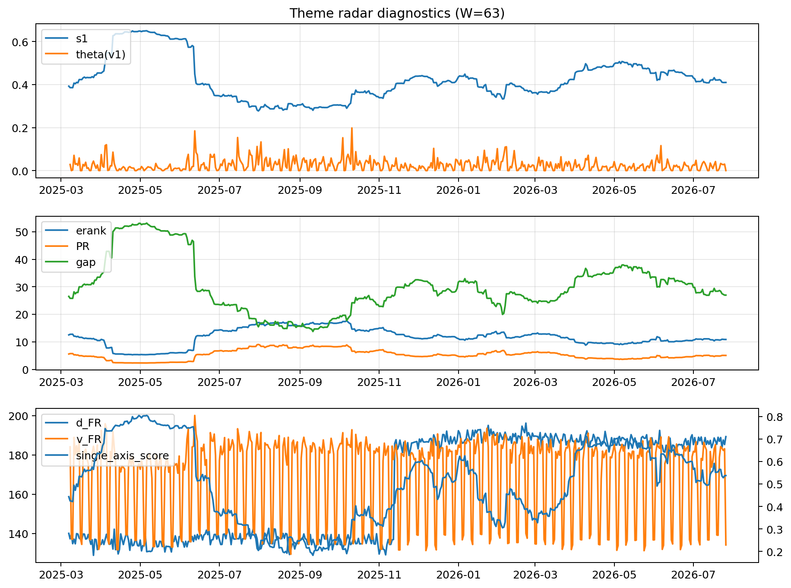

# Theme Radar Daily Brief — 2026-07-26

## Leaders (v1) — W=63
- **Nuclear_Uranium** (0.086536682422353)
- Semis (0.0681856440030416)
- Quantum (0.055472447565724)

## Challengers — W=63
**v2:** Semis (0.0863383687745493), MegaCap_AI (0.0845833986381719), Rates (0.0652404491903173)
**v3:** Software_Cloud (0.0968156847628935), Grid_Power (0.0651969657339807), Crypto (0.0624366808317012)

## Migration (20D slope) — W=63
**Top risers:**
- axis_Sector_RealEstate: 0.0003050161374572
- axis_Sector_Utilities: 0.0001954164554716
- axis_Nuclear_Uranium: 0.00019218581331
- axis_Cyber: 0.0001860275481483
- axis_Software_Cloud: 0.0001639029833464
- axis_Semis: 0.0001623322460108
- axis_Crypto: 0.0001564963225719
- axis_Quantum: 0.0001510231152555
- axis_Sector_Health: 0.0001389134443871
- axis_Sector_ConsStap: 0.0001240791777942

**Top fallers:**
- axis_USD: -9.043012919478546e-05
- axis_Sector_Ind: -0.0001031873801962
- axis_MegaCap_AI: -0.0001203020825368
- axis_Defense: -0.0001379101339349
- axis_Sector_ConsDisc: -0.000142059105552
- axis_Credit: -0.0001881113090252
- axis_Sector_Materials: -0.00021399726026
- axis_Commodities: -0.00024009793117
- axis_DataCenter_Infra: -0.0004609415530247
- axis_Rates: -0.0005322537647555

## Risk line (W=63)
- s1: 0.4098263572797757
- theta_v1: 0.0004169932951424
- v_FR: 134.18652534445675
- single_axis_score: 0.5372781065088758

## Interpretation
**Regime:** `theme_migration`

- Action: Tomorrow watchlist: Sector_RealEstate, Sector_Utilities, Nuclear_Uranium, Cyber, Software_Cloud + v2_top1=Semis
- Action: Hedge note: normal correlation stability.

- Percentiles (W=63 history): vfr_pct=0.06, theta_pct=0.15, s1_pct=0.50, score_pct=0.56.

---
**BUNDLE_ROOT_SHA256:** `f1def583bdb457ed63833303b540964aad64cf79401a9cf053d3400a5bf87e1d`
