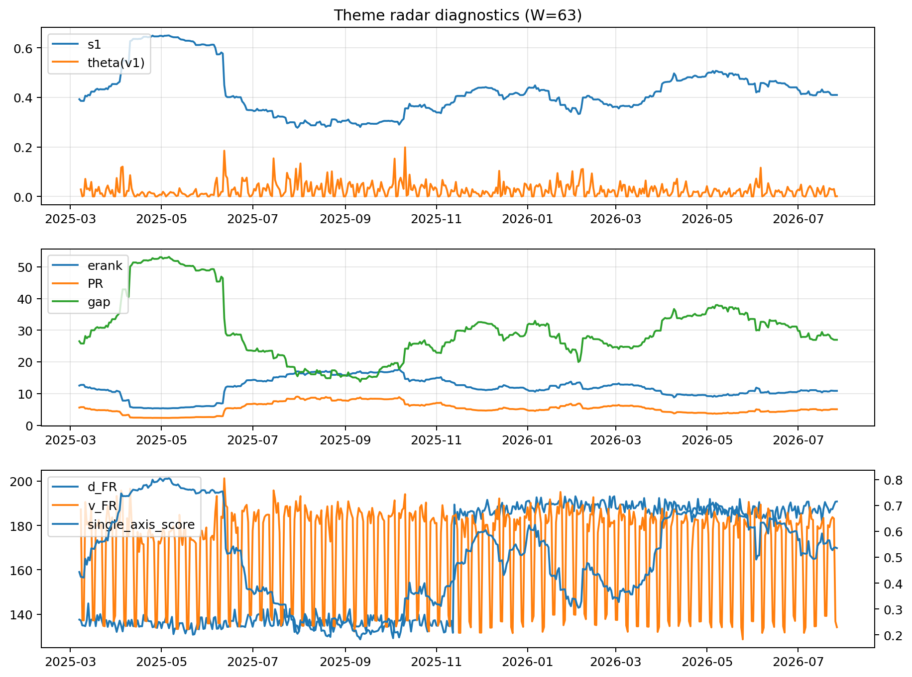

# Theme Radar Daily Brief — 2026-07-27

## Leaders (v1) — W=63
- **Nuclear_Uranium** (0.0865557951871155)
- Semis (0.0682037383844332)
- Quantum (0.0554852925009955)

## Challengers — W=63
**v2:** Semis (0.0863339918511408), MegaCap_AI (0.084605602660338), Rates (0.065326719617639)
**v3:** Software_Cloud (0.0968587055589441), Grid_Power (0.0652659223096041), Crypto (0.06240418741771)

## Migration (20D slope) — W=63
**Top risers:**
- axis_Sector_RealEstate: 0.0002918857254476
- axis_Quantum: 0.0002215030286921
- axis_Sector_Utilities: 0.0002018074505274
- axis_Semis: 0.0001921124544444
- axis_Crypto: 0.0001842251364681
- axis_Nuclear_Uranium: 0.000178271439988
- axis_Sector_Health: 0.0001352294713527
- axis_Cyber: 0.0001339973832991
- axis_Space: 0.0001217052743342
- axis_Metals: 0.0001211163021401

**Top fallers:**
- axis_USD: -8.321814689526019e-05
- axis_MegaCap_AI: -8.575097336049486e-05
- axis_Sector_Ind: -0.0001103630103362
- axis_Defense: -0.0001484837154268
- axis_Sector_ConsDisc: -0.0001541876977262
- axis_Credit: -0.0001998395249568
- axis_Sector_Materials: -0.000217314230055
- axis_Commodities: -0.0002565917339393
- axis_DataCenter_Infra: -0.000450979097065
- axis_Rates: -0.0005870866092325

## Risk line (W=63)
- s1: 0.4097457700747397
- theta_v1: 0.0010166736287368
- v_FR: 134.08562193947338
- single_axis_score: 0.5350393700787401

## Interpretation
**Regime:** `theme_migration`

- Action: Tomorrow watchlist: Sector_RealEstate, Quantum, Sector_Utilities, Semis, Crypto + v2_top1=Semis
- Action: Hedge note: normal correlation stability.

- Percentiles (W=63 history): vfr_pct=0.06, theta_pct=0.21, s1_pct=0.50, score_pct=0.55.

---
**BUNDLE_ROOT_SHA256:** `7247896f30ad5de2a3738e8b97957bd25c8ed597886475384ffea6a116b707bf`
