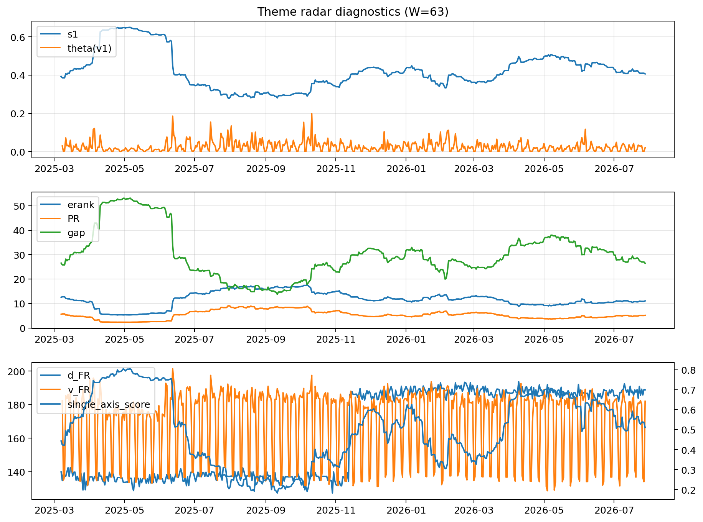

# Theme Radar Daily Brief — 2026-07-28

## Leaders (v1) — W=63
- **Nuclear_Uranium** (0.0869762730611533)
- Semis (0.0669681436553533)
- Quantum (0.054282799963759)

## Challengers — W=63
**v2:** Semis (0.0896558882102971), MegaCap_AI (0.0887447835528889), Grid_Power (0.0683894758230301)
**v3:** Software_Cloud (0.0937093270094895), DataCenter_Infra (0.065520708016784), Quantum (0.0633539162287385)

## Migration (20D slope) — W=63
**Top risers:**
- axis_Sector_RealEstate: 0.0002801421785225
- axis_Quantum: 0.0002689637438681
- axis_Sector_Utilities: 0.00021452929518
- axis_Semis: 0.0001998864230048
- axis_Crypto: 0.0001972517838283
- axis_Nuclear_Uranium: 0.0001931627319465
- axis_Space: 0.0001494003798824
- axis_Metals: 0.0001371293104172
- axis_Sector_Health: 0.0001370713492284
- axis_Critical_Minerals: 0.0001088663850366

**Top fallers:**
- axis_MegaCap_AI: -8.097658880391097e-05
- axis_Sector_Fin: -8.42439636502987e-05
- axis_Sector_Ind: -0.000112595904905
- axis_Defense: -0.0001450212750845
- axis_Sector_ConsDisc: -0.00016406007845
- axis_Credit: -0.0002052392250892
- axis_Sector_Materials: -0.0002139577589492
- axis_Commodities: -0.0002522128874591
- axis_DataCenter_Infra: -0.000473704970687
- axis_Rates: -0.0006089762326469

## Risk line (W=63)
- s1: 0.4059244903878017
- theta_v1: 0.0196528434422328
- v_FR: 181.99850243701545
- single_axis_score: 0.5108055009823183

## Interpretation
**Regime:** `theme_migration`

- Action: Tomorrow watchlist: Sector_RealEstate, Quantum, Sector_Utilities, Semis, Crypto + v2_top1=Semis
- Action: Hedge note: normal correlation stability.

- Percentiles (W=63 history): vfr_pct=0.58, theta_pct=0.51, s1_pct=0.46, score_pct=0.49.

---
**BUNDLE_ROOT_SHA256:** `27711238f280af1b78691c2564d3cd59161b480022872f24da43bea6f1a8e55b`
