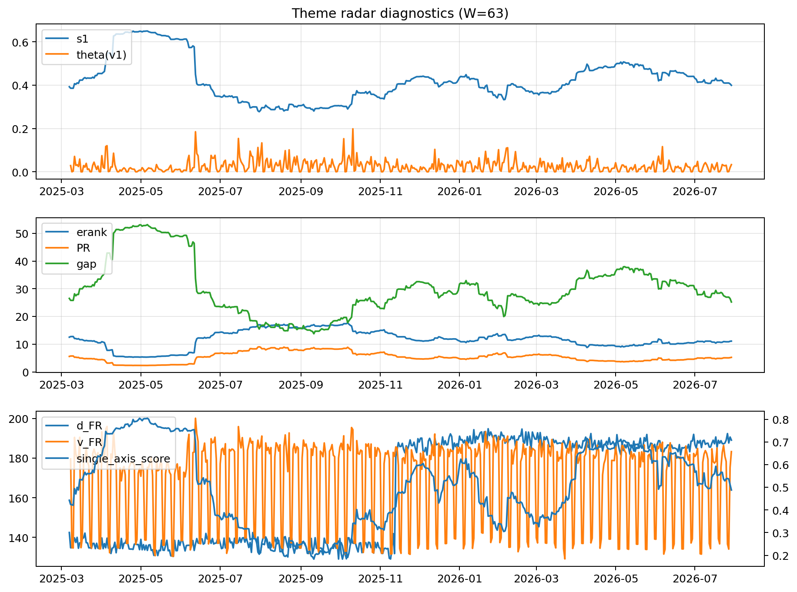

# Theme Radar Daily Brief — 2026-07-29

## Leaders (v1) — W=63
- **Nuclear_Uranium** (0.087666634838789)
- Semis (0.0679837410874008)
- Quantum (0.0567899721010776)

## Challengers — W=63
**v2:** MegaCap_AI (0.0852255040959976), Semis (0.0843861961440227), Rates (0.0701496968212521)
**v3:** Software_Cloud (0.0968305837409671), Grid_Power (0.0653711515998373), DataCenter_Infra (0.0632817511080945)

## Migration (20D slope) — W=63
**Top risers:**
- axis_Quantum: 0.0003450539666802
- axis_Sector_RealEstate: 0.0002806814905837
- axis_Crypto: 0.0002575745540925
- axis_Sector_Utilities: 0.0002210986937955
- axis_Semis: 0.0002171280189496
- axis_Nuclear_Uranium: 0.0001968309967202
- axis_Space: 0.0001741001232032
- axis_Metals: 0.0001436007394005
- axis_Sector_Health: 0.0001340070485414
- axis_Critical_Minerals: 0.0001194359707043

**Top fallers:**
- axis_Sector_Energy: -9.642554255526262e-05
- axis_MegaCap_AI: -9.804686564141962e-05
- axis_Sector_Ind: -0.0001171574359627
- axis_Defense: -0.0001541878027484
- axis_Sector_ConsDisc: -0.0001778680446197
- axis_Credit: -0.0002232685960631
- axis_Sector_Materials: -0.0002240429896483
- axis_Commodities: -0.0002806900034583
- axis_DataCenter_Infra: -0.0004952625166842
- axis_Rates: -0.0006683378054026

## Risk line (W=63)
- s1: 0.3992505497501757
- theta_v1: 0.0331436148049921
- v_FR: 183.30075102063552
- single_axis_score: 0.487843137254902

## Interpretation
**Regime:** `theme_migration`

- Action: Tomorrow watchlist: Quantum, Sector_RealEstate, Crypto, Sector_Utilities, Semis + v2_top1=MegaCap_AI
- Action: Hedge note: normal correlation stability.

- Percentiles (W=63 history): vfr_pct=0.65, theta_pct=0.72, s1_pct=0.41, score_pct=0.45.

---
**BUNDLE_ROOT_SHA256:** `2c51ce350e6ca7599dee4c3a7841633ca41391f196e579ce429b48bb4ae5a6b4`
