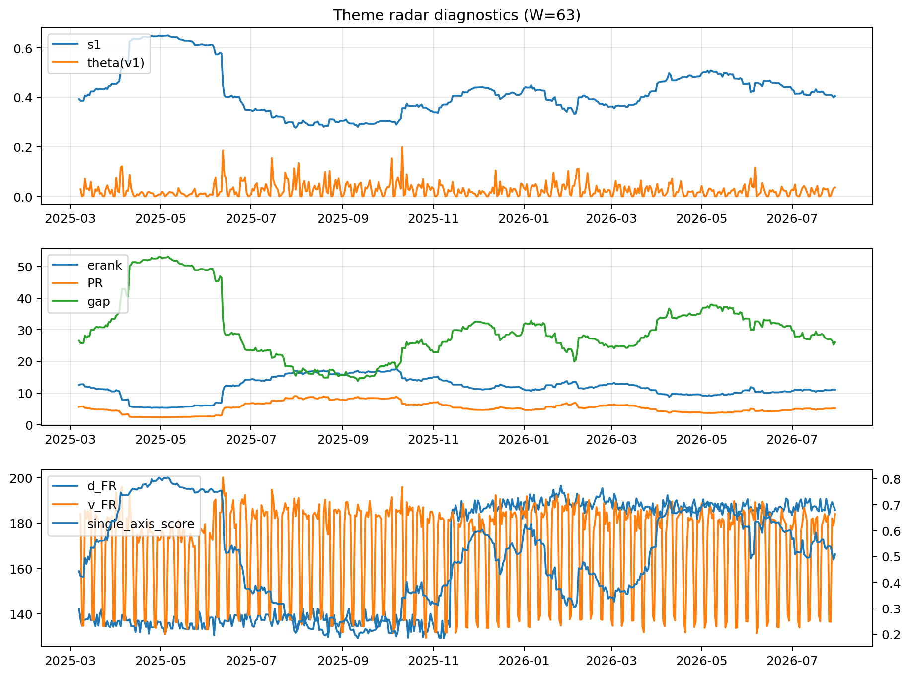

# Theme Radar Daily Brief — 2026-07-30

## Leaders (v1) — W=63
- **Nuclear_Uranium** (0.087791089507647)
- Semis (0.0678350178955152)
- Quantum (0.0570041394321066)

## Challengers — W=63
**v2:** MegaCap_AI (0.0873514404763301), Semis (0.0857894168016745), Rates (0.0670749260861705)
**v3:** Software_Cloud (0.0969037668385524), DataCenter_Infra (0.0730928101626049), Grid_Power (0.0640468741522291)

## Migration (20D slope) — W=63
**Top risers:**
- axis_Quantum: 0.0004032723980842
- axis_Crypto: 0.0003033842857691
- axis_Sector_RealEstate: 0.0002742688809631
- axis_Semis: 0.0002258594184702
- axis_Sector_Utilities: 0.0002067332258309
- axis_Space: 0.0001886830443347
- axis_Nuclear_Uranium: 0.0001869286721007
- axis_Metals: 0.0001332538886041
- axis_Sector_Health: 0.0001257017017623
- axis_Critical_Minerals: 0.0001100976491162

**Top fallers:**
- axis_USD: -9.832491238402448e-05
- axis_Sector_Energy: -0.0001113759040877
- axis_Sector_Ind: -0.000119561099996
- axis_Defense: -0.0001559405742753
- axis_Sector_ConsDisc: -0.0001801911479623
- axis_Sector_Materials: -0.0002275734610922
- axis_Credit: -0.0002320102340999
- axis_Commodities: -0.0002955273767394
- axis_DataCenter_Infra: -0.0004965726494965
- axis_Rates: -0.0007110126828515

## Risk line (W=63)
- s1: 0.403974521562039
- theta_v1: 0.0358382523550054
- v_FR: 183.989169245562
- single_axis_score: 0.508023483365949

## Interpretation
**Regime:** `theme_migration`

- Action: Tomorrow watchlist: Quantum, Crypto, Sector_RealEstate, Semis, Sector_Utilities + v2_top1=MegaCap_AI
- Action: Hedge note: normal correlation stability.

- Percentiles (W=63 history): vfr_pct=0.70, theta_pct=0.75, s1_pct=0.44, score_pct=0.48.

---
**BUNDLE_ROOT_SHA256:** `fc227803bb282434d4669b092c88091c4da365e57216d2a8f800386596002a44`
