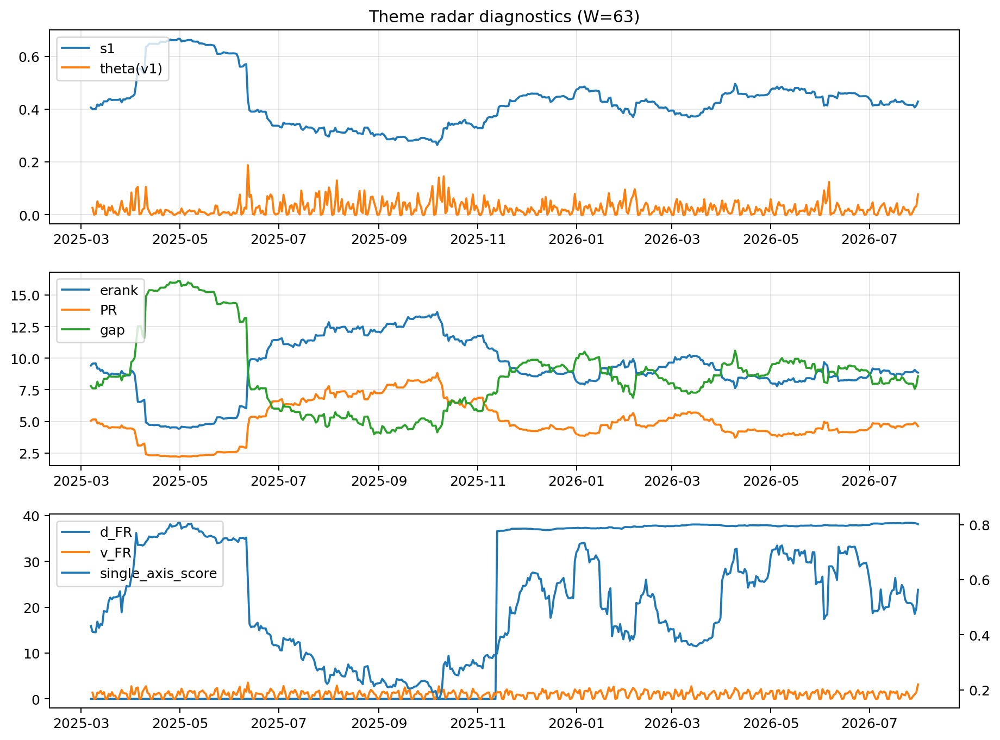

# Theme Radar Daily Brief — 2026-07-31

## Leaders (v1) — W=63
- **Nuclear_Uranium** (0.1955223565995688)
- Equity_ExUS (0.1061061779637193)
- Metals (0.0949987172993083)

## Challengers — W=63
**v2:** Sector_Fin (0.10593510200463), Grid_Power (0.0983196519219951), Sector_Comm (0.0939467309501836)
**v3:** Grid_Power (0.1075949334436596), Nuclear_Uranium (0.0988645158762396), Sector_Ind (0.0910267318579572)

## Migration (20D slope) — W=63
**Top risers:**
- axis_Space: 0.0004984631569614
- axis_Nuclear_Uranium: 0.0004084012088695
- axis_Sector_Utilities: 0.0003097710465764
- axis_Clean_Solar: 0.0002296273278336
- axis_Grid_Power: 0.0002058514818643
- axis_Semis: 0.0002050103952689
- axis_Quantum: 0.0001860452998698
- axis_Crypto: 0.000162172887692
- axis_Equity_ExUS: 0.0001339510532301
- axis_MegaCap_AI: 0.0001201406524843

**Top fallers:**
- axis_Sector_ConsStap: 0.0
- axis_Defense: 0.0
- axis_Genomics_Bio: -1.157646390209555e-05
- axis_Drones_Autonomy: -3.482979634902678e-05
- axis_Equity_US: -0.0001649696768127
- axis_Sector_Fin: -0.0002733306562532
- axis_Sector_Ind: -0.0003734174536017
- axis_Sector_Comm: -0.0004122585476833
- axis_Credit: -0.0005626091043695
- axis_Sector_Materials: -0.0008026723955279

## Risk line (W=63)
- s1: 0.4284114881653872
- theta_v1: 0.0772869579180955
- v_FR: 3.1603562677508603
- single_axis_score: 0.563671875

## Interpretation
**Regime:** `structure_rewrite`

- Action: Tomorrow watchlist: Space, Nuclear_Uranium, Sector_Utilities, Clean_Solar, Grid_Power + v2_top1=Sector_Fin
- Action: Hedge note: v_FR high + theta high → correlation structure unstable; diversify hedges / reduce reliance on static correlations.

- Percentiles (W=63 history): vfr_pct=1.00, theta_pct=0.95, s1_pct=0.52, score_pct=0.60.

---
**BUNDLE_ROOT_SHA256:** `42bbb5469bfefd2b13a644856b0c29fcb115927625d5dbc45ad14f21cef6a8dd`
