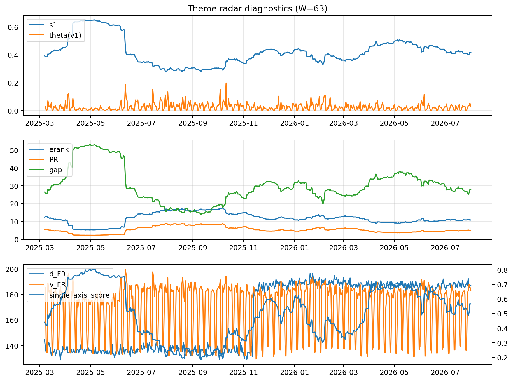

# Theme Radar Daily Brief — 2026-08-01

## Leaders (v1) — W=63
- **Nuclear_Uranium** (0.0888094168456201)
- Semis (0.0693200309869958)
- Quantum (0.058154545112164)

## Challengers — W=63
**v2:** Semis (0.0851828653952653), Rates (0.0773153334965999), MegaCap_AI (0.0618105320722486)
**v3:** Software_Cloud (0.1078804309980338), DataCenter_Infra (0.0745530328562321), MegaCap_AI (0.0652097156061626)

## Migration (20D slope) — W=63
**Top risers:**
- axis_Quantum: 0.0005101805176624
- axis_Crypto: 0.0003256369985887
- axis_Semis: 0.0002610613917172
- axis_Sector_RealEstate: 0.0002600149599111
- axis_Space: 0.0002435136302497
- axis_Nuclear_Uranium: 0.0002410593081221
- axis_Sector_Utilities: 0.0001591129722973
- axis_Sector_Health: 0.0001303707173216
- axis_Metals: 0.0001149201377079
- axis_Drones_Autonomy: 0.0001109211795823

**Top fallers:**
- axis_USD: -0.0001083682449276
- axis_Sector_Comm: -0.0001383507477641
- axis_Sector_Energy: -0.0001600964084502
- axis_Defense: -0.0001638578264468
- axis_Sector_ConsDisc: -0.000186283828863
- axis_Sector_Materials: -0.0002452801057008
- axis_Credit: -0.0002539049941163
- axis_Commodities: -0.0003019559411901
- axis_DataCenter_Infra: -0.0003921390021924
- axis_Rates: -0.000847395513718

## Risk line (W=63)
- s1: 0.4156918978960711
- theta_v1: 0.0280845417073468
- v_FR: 183.07031458690383
- single_axis_score: 0.5660818713450292

## Interpretation
**Regime:** `theme_migration`

- Action: Tomorrow watchlist: Quantum, Crypto, Semis, Sector_RealEstate, Space + v2_top1=Semis
- Action: Hedge note: normal correlation stability.

- Percentiles (W=63 history): vfr_pct=0.66, theta_pct=0.63, s1_pct=0.53, score_pct=0.62.

---
**BUNDLE_ROOT_SHA256:** `aa11a57a059f76d5bf6c7620d6a55a6090d712a7d9cf21baf5988a715a9af8f1`
