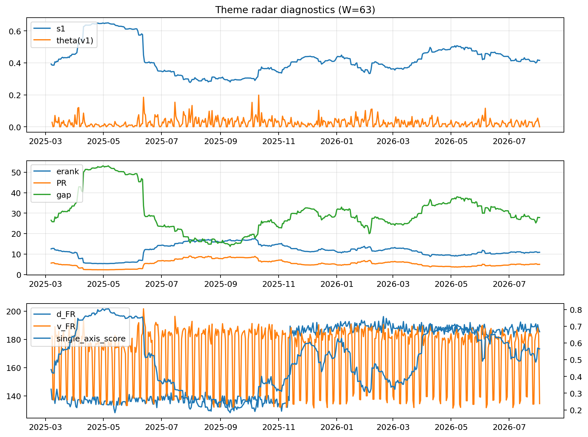

# Theme Radar Daily Brief — 2026-08-02

## Leaders (v1) — W=63
- **Nuclear_Uranium** (0.0888108369972097)
- Semis (0.0693227680150938)
- Quantum (0.0581552830669521)

## Challengers — W=63
**v2:** Semis (0.0851756846996967), Rates (0.0773136590251575), MegaCap_AI (0.0618088119596566)
**v3:** Software_Cloud (0.1078962996489256), DataCenter_Infra (0.0745609647279895), MegaCap_AI (0.065224804947188)

## Migration (20D slope) — W=63
**Top risers:**
- axis_Quantum: 0.0005506181916941
- axis_Crypto: 0.0003196910325302
- axis_Semis: 0.0002749565570262
- axis_Space: 0.000266680604029
- axis_Nuclear_Uranium: 0.0002620018571788
- axis_Sector_RealEstate: 0.0002424474221397
- axis_Sector_Utilities: 0.000129679758623
- axis_Sector_Health: 0.0001265557528617
- axis_Drones_Autonomy: 0.0001135370236588
- axis_Metals: 0.0001018001074271

**Top fallers:**
- axis_USD: -0.0001098911102111
- axis_Defense: -0.0001611923248221
- axis_Sector_Comm: -0.0001693687278749
- axis_Sector_Energy: -0.0001811238726628
- axis_Sector_ConsDisc: -0.0001850630488726
- axis_Sector_Materials: -0.0002453005434903
- axis_Credit: -0.0002562687369469
- axis_Commodities: -0.0003016167060883
- axis_DataCenter_Infra: -0.0003322808733167
- axis_Rates: -0.0008864484398611

## Risk line (W=63)
- s1: 0.415679473710569
- theta_v1: 0.0001748810913616
- v_FR: 134.49875904554708
- single_axis_score: 0.564591439688716

## Interpretation
**Regime:** `theme_migration`

- Action: Tomorrow watchlist: Quantum, Crypto, Semis, Space, Nuclear_Uranium + v2_top1=Semis
- Action: Hedge note: normal correlation stability.

- Percentiles (W=63 history): vfr_pct=0.09, theta_pct=0.09, s1_pct=0.53, score_pct=0.61.

---
**BUNDLE_ROOT_SHA256:** `e10b26695d1c11da8479b905de8baf9b718e732ae9e9382df68cc411f2e27a4b`
