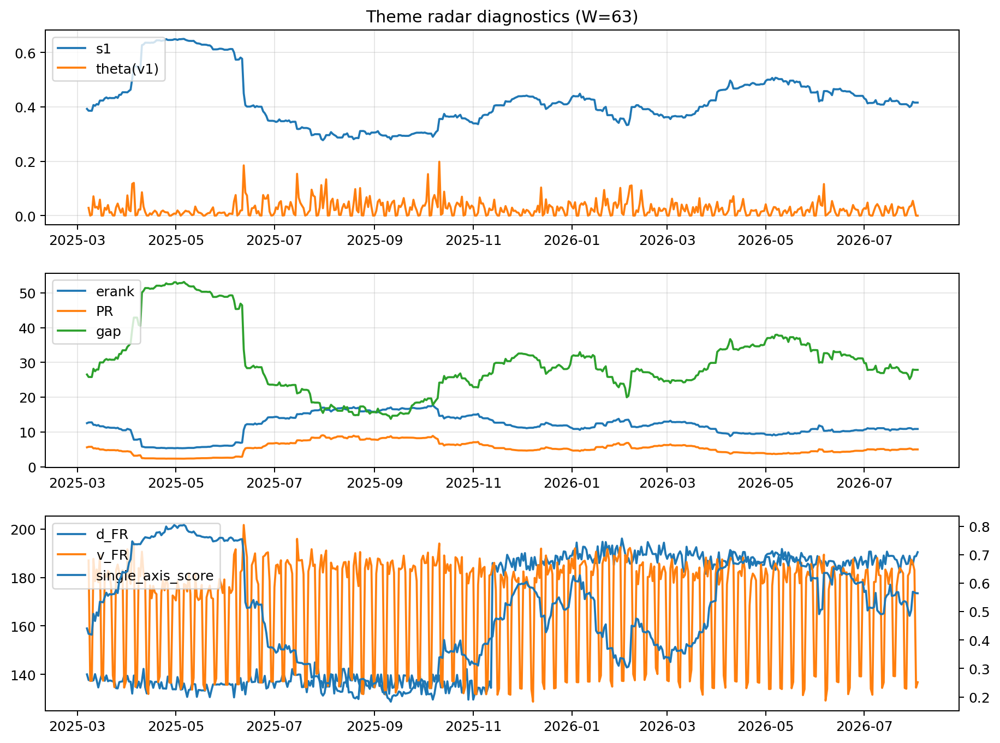

# Theme Radar Daily Brief — 2026-08-03

## Leaders (v1) — W=63
- **Nuclear_Uranium** (0.0888138529249647)
- Semis (0.0693234968832225)
- Quantum (0.0581579449914897)

## Challengers — W=63
**v2:** Semis (0.0851856291961446), Rates (0.0773399336892751), MegaCap_AI (0.0618166060542759)
**v3:** Software_Cloud (0.1078968639252219), DataCenter_Infra (0.0745576693702665), MegaCap_AI (0.0652175886771903)

## Migration (20D slope) — W=63
**Top risers:**
- axis_Quantum: 0.0005756812142678
- axis_Crypto: 0.0003002294326484
- axis_Semis: 0.0002807843298781
- axis_Space: 0.0002730129945221
- axis_Nuclear_Uranium: 0.0002697498733139
- axis_Sector_RealEstate: 0.0002215976401211
- axis_Sector_Health: 0.0001156313163989
- axis_Drones_Autonomy: 0.0001115716538667
- axis_Sector_Utilities: 0.0001030128021203
- axis_Robotics: 9.42006189881436e-05

**Top fallers:**
- axis_Software_Cloud: -0.0001125173841209
- axis_Defense: -0.000155667418013
- axis_Sector_ConsDisc: -0.0001766147050904
- axis_Sector_Energy: -0.0001774424619923
- axis_Sector_Comm: -0.0001916599770781
- axis_Commodities: -0.0002404320188944
- axis_Credit: -0.0002419662125625
- axis_Sector_Materials: -0.0002429786099852
- axis_DataCenter_Infra: -0.0002658750902119
- axis_Rates: -0.0008751151425725

## Risk line (W=63)
- s1: 0.4156775295014104
- theta_v1: 5.320014231211447e-05
- v_FR: 136.7527022368078
- single_axis_score: 0.5642718446601942

## Interpretation
**Regime:** `theme_migration`

- Action: Tomorrow watchlist: Quantum, Crypto, Semis, Space, Nuclear_Uranium + v2_top1=Semis
- Action: Hedge note: normal correlation stability.

- Percentiles (W=63 history): vfr_pct=0.16, theta_pct=0.03, s1_pct=0.53, score_pct=0.61.

---
**BUNDLE_ROOT_SHA256:** `88dc48188e9732e76319d010afa073f895fcc55cebc53c9c44d670ff1b65ea8b`
