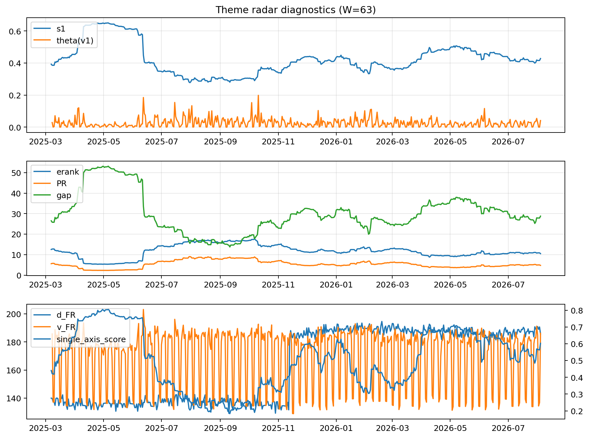

# Theme Radar Daily Brief — 2026-08-04

## Leaders (v1) — W=63
- **Nuclear_Uranium** (0.0875733985789955)
- Semis (0.0671519190754241)
- Quantum (0.0576196053119693)

## Challengers — W=63
**v2:** Semis (0.0873047538400491), Rates (0.0729756613479231), Software_Cloud (0.072257998026646)
**v3:** Software_Cloud (0.0770695253383771), DataCenter_Infra (0.0751713925474786), Rates (0.0722477001377203)

## Migration (20D slope) — W=63
**Top risers:**
- axis_Quantum: 0.0005774852990953
- axis_Space: 0.0002912588666017
- axis_Crypto: 0.0002703948389089
- axis_Nuclear_Uranium: 0.0002547811173299
- axis_Semis: 0.000247166225661
- axis_Sector_RealEstate: 0.0001955787865754
- axis_Drones_Autonomy: 0.0001199774036284
- axis_Sector_Health: 0.0001026832977569
- axis_Cyber: 9.758054176099687e-05
- axis_Robotics: 8.503548412438627e-05

**Top fallers:**
- axis_Genomics_Bio: -0.0001043517515801
- axis_Defense: -0.0001390356207185
- axis_Sector_ConsDisc: -0.0001604744049031
- axis_Sector_Energy: -0.0001683857078559
- axis_Commodities: -0.0001771374482344
- axis_Sector_Comm: -0.000191663689205
- axis_DataCenter_Infra: -0.0002164830186152
- axis_Credit: -0.000221241844796
- axis_Sector_Materials: -0.0002331907250182
- axis_Rates: -0.0008438138727468

## Risk line (W=63)
- s1: 0.4278131467564238
- theta_v1: 0.0410761124874601
- v_FR: 186.1607567636628
- single_axis_score: 0.6027131782945736

## Interpretation
**Regime:** `theme_migration`

- Action: Tomorrow watchlist: Quantum, Space, Crypto, Nuclear_Uranium, Semis + v2_top1=Semis
- Action: Hedge note: normal correlation stability.

- Percentiles (W=63 history): vfr_pct=0.82, theta_pct=0.80, s1_pct=0.60, score_pct=0.67.

---
**BUNDLE_ROOT_SHA256:** `4c04c3000f2b5c73adb5b2cfc94a27f25db00f706032409babc84a63fd6e8895`
