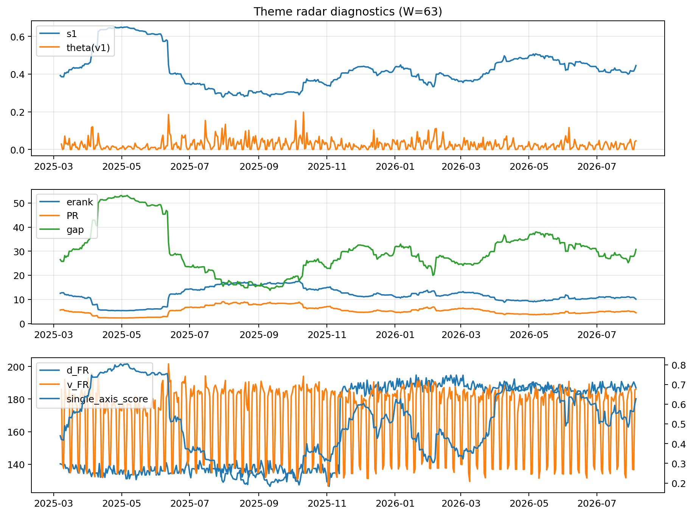

# Theme Radar Daily Brief — 2026-08-05

## Leaders (v1) — W=63
- **Nuclear_Uranium** (0.0860076294633786)
- Semis (0.0655938493573032)
- Quantum (0.0566437907458855)

## Challengers — W=63
**v2:** Semis (0.087848444215308), Rates (0.0788569441012883), Software_Cloud (0.0678812959015164)
**v3:** Software_Cloud (0.0759974868528678), DataCenter_Infra (0.0708369036361847), Rates (0.0617292953213965)

## Migration (20D slope) — W=63
**Top risers:**
- axis_Quantum: 0.0005529021143773
- axis_Space: 0.0002857638196228
- axis_Crypto: 0.0002832962600755
- axis_Nuclear_Uranium: 0.0002203718736032
- axis_Semis: 0.0001865077001482
- axis_Sector_RealEstate: 0.0001570323453805
- axis_Drones_Autonomy: 0.0001406409768854
- axis_Cyber: 0.0001317049959834
- axis_Sector_Health: 8.034479147157714e-05
- axis_Robotics: 6.567429047145873e-05

**Top fallers:**
- axis_Commodities: -8.595398011615735e-05
- axis_USD: -0.0001076761432505
- axis_Defense: -0.0001177630633493
- axis_Sector_ConsDisc: -0.000147142148824
- axis_Sector_Energy: -0.0001528487269704
- axis_DataCenter_Infra: -0.0001590117867724
- axis_Sector_Comm: -0.000182016669067
- axis_Credit: -0.0001937926523141
- axis_Sector_Materials: -0.0002114056247253
- axis_Rates: -0.0007698658602483

## Risk line (W=63)
- s1: 0.4449961611305231
- theta_v1: 0.046146582514491
- v_FR: 186.16159925112848
- single_axis_score: 0.6274661508704062

## Interpretation
**Regime:** `theme_migration`

- Action: Tomorrow watchlist: Quantum, Space, Crypto, Nuclear_Uranium, Semis + v2_top1=Semis
- Action: Hedge note: normal correlation stability.

- Percentiles (W=63 history): vfr_pct=0.84, theta_pct=0.83, s1_pct=0.69, score_pct=0.71.

---
**BUNDLE_ROOT_SHA256:** `8d1399670254ab8e68e7ab0c9da94f80f06ce703263cfefc6a007c18e5cc96bf`
