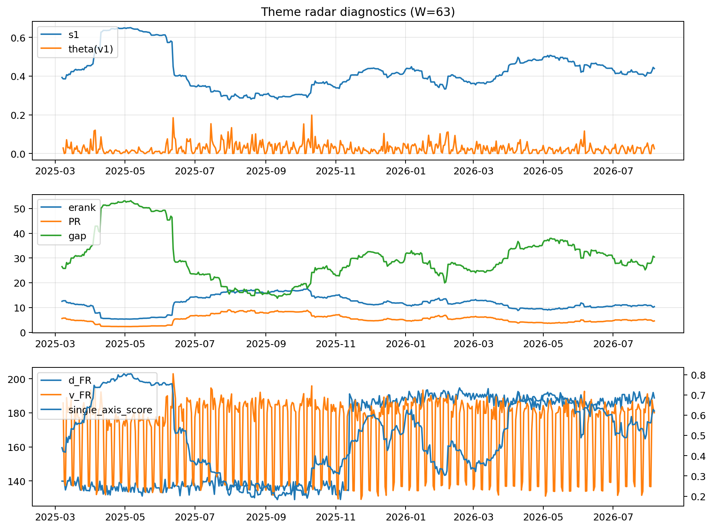

# Theme Radar Daily Brief — 2026-08-06

## Leaders (v1) — W=63
- **Nuclear_Uranium** (0.0867587175818699)
- Semis (0.0676621678253929)
- Quantum (0.0570421355625971)

## Challengers — W=63
**v2:** Rates (0.0835382867688734), Semis (0.0828284521546443), Software_Cloud (0.0653750628283745)
**v3:** Software_Cloud (0.0864828339434583), DataCenter_Infra (0.0772721366477408), MegaCap_AI (0.0614296517934205)

## Migration (20D slope) — W=63
**Top risers:**
- axis_Quantum: 0.0005257523430377
- axis_Crypto: 0.0002878619206447
- axis_Space: 0.0002818335202201
- axis_Nuclear_Uranium: 0.0001917380170507
- axis_Semis: 0.0001570711636278
- axis_Cyber: 0.0001548863338162
- axis_Drones_Autonomy: 0.0001415354235236
- axis_Sector_RealEstate: 0.0001289618885456
- axis_Sector_Health: 6.491682129965269e-05
- axis_Sector_Utilities: 4.766637808137716e-05

**Top fallers:**
- axis_MegaCap_AI: -7.658499683183116e-05
- axis_DataCenter_Infra: -9.138170358202069e-05
- axis_Defense: -9.39903342734762e-05
- axis_USD: -0.0001077527561574
- axis_Sector_ConsDisc: -0.0001382079093524
- axis_Sector_Energy: -0.0001385867891026
- axis_Credit: -0.000173423540254
- axis_Sector_Comm: -0.0001739207692567
- axis_Sector_Materials: -0.0001931604778867
- axis_Rates: -0.0007003002349858

## Risk line (W=63)
- s1: 0.4389106149384609
- theta_v1: 0.0249154623174988
- v_FR: 180.10199863355757
- single_axis_score: 0.6204633204633205

## Interpretation
**Regime:** `theme_migration`

- Action: Tomorrow watchlist: Quantum, Crypto, Space, Nuclear_Uranium, Semis + v2_top1=Rates
- Action: Hedge note: normal correlation stability.

- Percentiles (W=63 history): vfr_pct=0.47, theta_pct=0.58, s1_pct=0.66, score_pct=0.71.

---
**BUNDLE_ROOT_SHA256:** `ff8ef7cab7c69a443474839a81816662838d7429319af4586de520d8d00e7b36`
