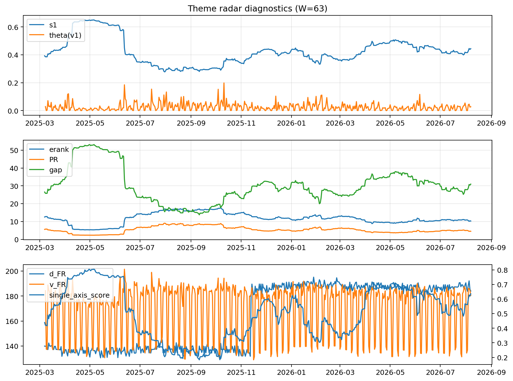

# Theme Radar Daily Brief — 2026-08-07

## Leaders (v1) — W=63
- **Nuclear_Uranium** (0.086441864485268)
- Semis (0.0702331033449151)
- Quantum (0.0568157465227726)

## Challengers — W=63
**v2:** Rates (0.0882139039010394), Semis (0.0820864245251293), Software_Cloud (0.0724307182160708)
**v3:** Software_Cloud (0.0787970597344418), DataCenter_Infra (0.0775915066487381), Space (0.0654974523092575)

## Migration (20D slope) — W=63
**Top risers:**
- axis_Quantum: 0.0004793027760806
- axis_Crypto: 0.0002661749904105
- axis_Space: 0.0002603120794478
- axis_Cyber: 0.0001959182142942
- axis_Semis: 0.0001639465149076
- axis_Nuclear_Uranium: 0.0001544832949259
- axis_Drones_Autonomy: 0.0001327759777701
- axis_Sector_RealEstate: 0.0001269968859811
- axis_Software_Cloud: 9.503603308636666e-05
- axis_Genomics_Bio: 7.800785624079157e-05

**Top fallers:**
- axis_Miners: -9.902108356379526e-05
- axis_Critical_Minerals: -0.000101512703848
- axis_USD: -0.0001138201942355
- axis_Sector_Energy: -0.0001281890086418
- axis_Sector_ConsDisc: -0.0001319177634148
- axis_Metals: -0.0001326142752394
- axis_Credit: -0.0001605810940724
- axis_Sector_Comm: -0.0001685959139431
- axis_Sector_Materials: -0.0001803054490506
- axis_Rates: -0.0006614064498871

## Risk line (W=63)
- s1: 0.443692034719582
- theta_v1: 0.0272493114600923
- v_FR: 180.42636728045304
- single_axis_score: 0.6354527938342966

## Interpretation
**Regime:** `theme_migration`

- Action: Tomorrow watchlist: Quantum, Crypto, Space, Cyber, Semis + v2_top1=Rates
- Action: Hedge note: normal correlation stability.

- Percentiles (W=63 history): vfr_pct=0.49, theta_pct=0.62, s1_pct=0.69, score_pct=0.72.

---
**BUNDLE_ROOT_SHA256:** `3da975d626d51bf9698c639825bfe1f34399e29c437950d0c39ffc074210d4b7`
