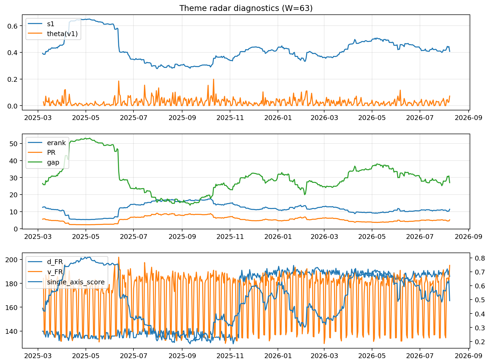

# Theme Radar Daily Brief — 2026-08-08

## Leaders (v1) — W=63
- **Nuclear_Uranium** (0.0888297054656174)
- Semis (0.0715144742126885)
- Quantum (0.0578221788328641)

## Challengers — W=63
**v2:** Rates (0.0876459332032682), Semis (0.0841039762192762), Software_Cloud (0.0724169270876066)
**v3:** Software_Cloud (0.0808926548808377), DataCenter_Infra (0.078647034114585), Space (0.0735306021179927)

## Migration (20D slope) — W=63
**Top risers:**
- axis_Quantum: 0.000436121259028
- axis_Space: 0.0002361108821787
- axis_Cyber: 0.000212113534162
- axis_Semis: 0.00018119639058
- axis_Crypto: 0.0001774765910688
- axis_Commodities: 0.0001650752993723
- axis_Nuclear_Uranium: 0.0001484802375206
- axis_Sector_RealEstate: 0.0001245182412768
- axis_Drones_Autonomy: 0.0001167207055038
- axis_Software_Cloud: 0.0001096978957732

**Top fallers:**
- axis_MegaCap_AI: -7.56914807035493e-05
- axis_Critical_Minerals: -0.0001192194318169
- axis_Sector_ConsDisc: -0.000121215380564
- axis_USD: -0.0001266586637854
- axis_Miners: -0.000130962057532
- axis_Credit: -0.0001486762792994
- axis_Sector_Materials: -0.0001682268628996
- axis_Sector_Comm: -0.0001743068312626
- axis_Metals: -0.0002204900225282
- axis_Rates: -0.0006439568820905

## Risk line (W=63)
- s1: 0.4073765449804397
- theta_v1: 0.0719303455744853
- v_FR: 195.08962089665133
- single_axis_score: 0.4923076923076923

## Interpretation
**Regime:** `structure_rewrite`

- Action: Tomorrow watchlist: Quantum, Space, Cyber, Semis, Crypto + v2_top1=Rates
- Action: Hedge note: v_FR high + theta high → correlation structure unstable; diversify hedges / reduce reliance on static correlations.

- Percentiles (W=63 history): vfr_pct=0.99, theta_pct=0.94, s1_pct=0.47, score_pct=0.46.

---
**BUNDLE_ROOT_SHA256:** `849e28f5c66d4bafffcd7ae2cef99a9d5c826969830a06cb12b9acc1a5f04a62`
